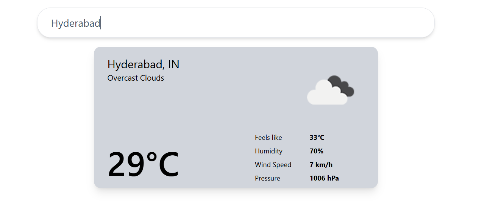

# 🌤️ Weather App

A clean and responsive weather application built with **React** and **Tailwind CSS** that fetches real-time weather data from the [OpenWeatherMap API](https://openweathermap.org/api). Just type a city name and hit Enter to get current weather details including temperature, humidity, wind speed, pressure, and more — along with a weather icon.

---

## 🔗 Live Demo

👉 [**Click here to use the app**](https://weather-saipavan214s-projects.vercel.app/)

---

## 🧪 Features

- 🔍 Search any city in the world
- 📡 Real-time weather updates via OpenWeatherMap API
- 🌡️ Shows:
  - Temperature
  - Feels like temperature
  - Weather condition (with icon)
  - Humidity
  - Wind Speed
  - Pressure
- 💨 Responsive layout using Tailwind CSS
- 🌙 Clean UI with minimalist design

---

## 🖼️ Screenshots



## ⚙️ Tech Stack

| Technology         | Description                   |
| ------------------ | ----------------------------- |
| React              | Frontend JavaScript framework |
| Tailwind CSS       | Utility-first CSS framework   |
| Axios              | HTTP client for API calls     |
| Vercel             | Deployment platform           |
| OpenWeatherMap API | Weather data provider         |

---

## 🚀 Getting Started

Clone and run this project locally:

```bash
# 1. Clone the repo
git clone https://github.com/SaiPavan214/Weather.git

# 2. Navigate to the project directory
cd Weather

# 3. Install dependencies
npm install

# 4. Start development server
npm run dev
🔐 API Key Setup
Go to OpenWeatherMap and sign up.

Generate your free API key.

Create a .env file in the root of your project:

env
Copy
Edit
VITE_WEATHER_API_KEY=your_openweather_api_key_here
In your code, access it using:

js
Copy
Edit
const API_KEY = import.meta.env.VITE_WEATHER_API_KEY;
📁 Project Structure
bash
Copy
Edit
Weather/
│
├── src/
│   ├── components/
│   │   └── Weather.jsx       # Weather UI component
│   ├── App.jsx               # Main logic and layout
│   └── main.jsx              # App entry point
│
├── public/
│   └── index.html
├── .env                      # API key
├── tailwind.config.js
└── package.json
📌 Potential Improvements
🌍 Auto-detect user location with Geolocation API

🌅 Display sunrise/sunset times

🌓 Dark mode toggle

❗ Error handling for invalid locations

💬 Toast notifications

🙋‍♂️ Author
Sai Pavan
📎 https://github.com/SaiPavan214
🌐 https://weather-saipavan214s-projects.vercel.app/
```
